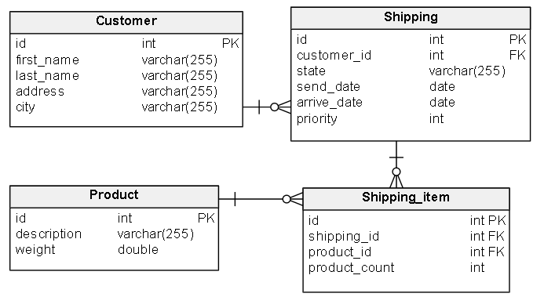

# Mareo Envíos

Marcos junto a sus amigos, cansados de las malas gestiones de las empresas de correo, se plantearon armar una empresa de envíos de mercadería a todo el país gestionadas digitalmente. Debido a la urgencia de salida al mercado, te contactaron para que le entregues WebService para que ellos puedan evolucionar con facilidad.

## Requerimientos técnicos

* __Arquitectura WS__: RESTful Json
* __Lenguaje__: Java 17
* __Formato proyecto__: maven
* __Framework__: Spring Boot
* __Base de datos__: MySQL o PostgreSQL

### Opcionales

* Incluir Dockerfile de 2 etapas para buildear con Docker
* Preparar todo el stack con docker-compose (IE: app + db)
* Escribir tests unitarios y de integración
* Documentar la API con Swagger

## Requerimientos funcionales

* Poder obtener información del comprador.
* Poder obtener información del envío y productos comprados.
* Poder cambiar el estado del envío siguiendo las siguientes reglas de negocio:
  * El estado inicial es “Inicial” y solo se puede transicionar a “Entregado al correo” y o “Cancelado”
  * El estado “Entregado al correo” solo se puede transicionar a “En camino” o “Cancelado”
  * El estado “En camino” solo se puede transicionar a “Entregado” o “Cancelado”
  * Los estados “Entregado” y “Cancelado” son estados finales y no se pueden transicionar.
* Obtener un listado con la descripción y cantidad de los 3 productos más solicitados para su envío.
* Tener en cuenta lo mencionado en el enunciado "ExamenPracticoConcurrenciaThreads" para poder evaluar el manejo de concurrencia, threads y alta disponibilidad

## Firmas a utilizar

* /customers/{customerId} <- GET
* /shippings/{shippingId} <- GET
* Firmas de transacciones:
  * /shippings/{shippingId}  <- PATCH
    * Body:
      * { transition: sendToMail }
      * { transition: inTravel }
      * { transition: delivered }
      * { transition: cancelled }
* /reports/top-sent <- GET

## Aclaraciones

* El usuario no pidió la creación de pedidos ya que nos comentó que lo tiene resuelto.
* Dejó la creación de su esquema de datos y algunos datos de ejemplo para que sea más sencillo realizar las pruebas
* Nos avisaron que el modelo de datos quedará fijo como nos lo pasaron, por lo cual no se pueden alterar las columnas ni crear tablas nuevas. Excepto para la tabla **Task_shipping** donde podra agregar mas columnas si lo considera necesario.
* Es necesario implementar manejo de errores en las respuestas de las distintas firmas.
* Se incluye _pom.xml_, scripts de base de datos y codigo minimo para inicializar el proyecto.

### Esquema

### Flujo estados

## Presentación

Enviar el proyecto en un repositorio github publico del usuario.
